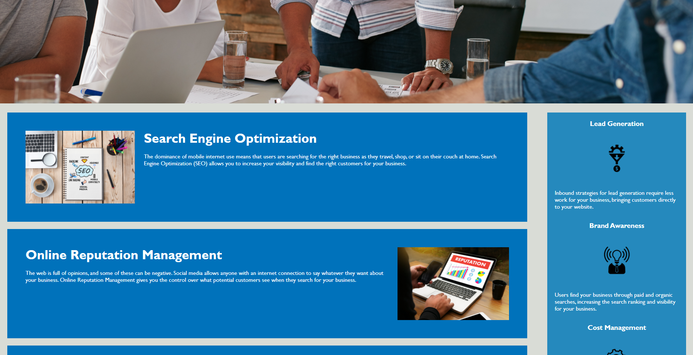
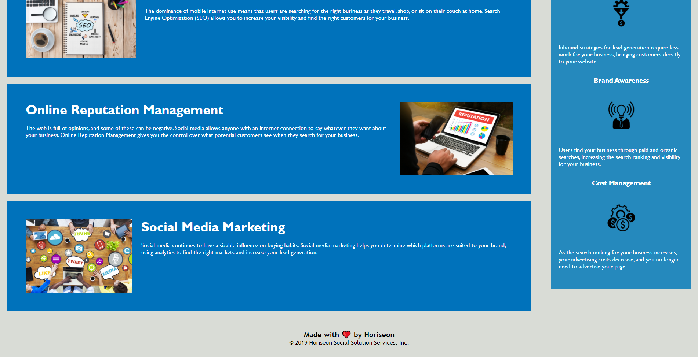

# Bootcamp-Horiseon-Refactor
## Description

A project to refactor existing HTML and CSS code to better optimize for accessibility.

This project aims to:
- Evaluating existing code
- Implement and follow SEO standards for accessibility using semantics
- Finding methods to refactor code to be more lightweight while preserving functionality

In the course of this project, I've honed my skills on formatting for clear readability, documenting portions of code with comments, and considering methods for optimizing code. GIT and Github were also powerful tools utilized in managing and deploying this project in the live space.

## Deployment
To view the deployed and current project: https://accoon.github.io/Bootcamp-Horiseon-Refactor/

## How it Should Look

## Sources
Original code source: https://unchar.bootcampcontent.com/The-Coding-Bootcamp/uncc-virt-fsf-ft-02-2021-u-c/tree/master/01-HTML-Git-CSS/02-Homework